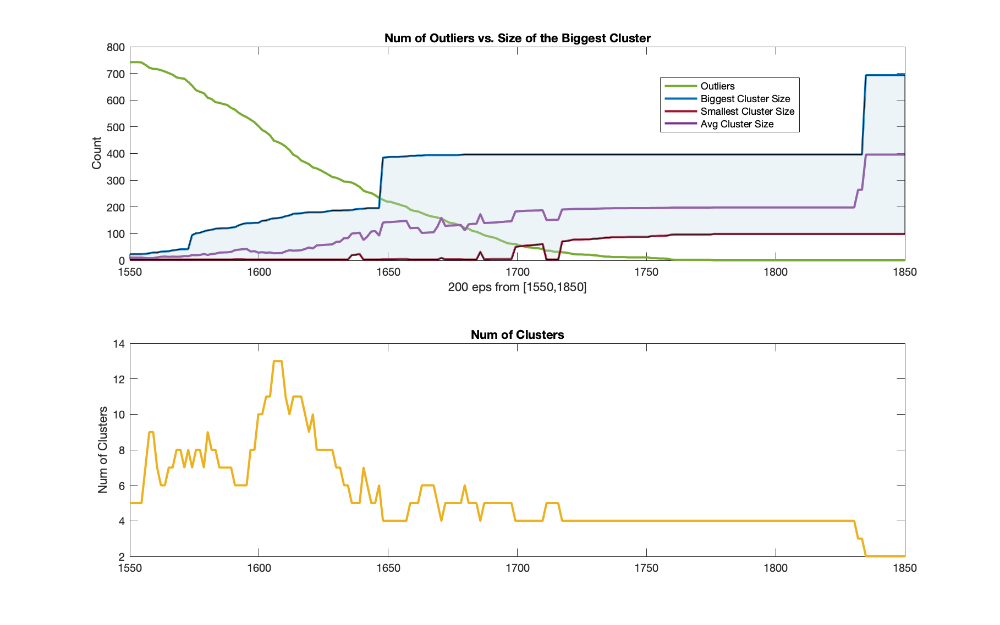

# DBSCAN
Matlab code for DBSCAN clustering on high dimentional data.
DBSCAN on different eps within a given range and make plots.

## DBSCAN on original data
Main for DBSCAN for original data is `main.m`

## DBSCAN with PCA
Main for DBSCAN on data after pca is `pca_main.m`

## Datasets
The datasets for this project is private
